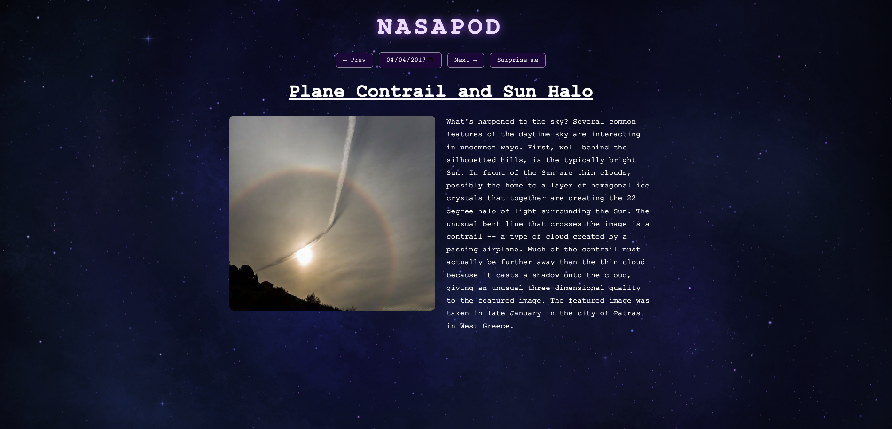

# NASApod
 
A space-themed viewer for NASA's **Astronomy Picture of the Day (APOD)**. Fetches the daily image (or video), lets you browse any date back to 1995, jump to a random day, and click images to view them fullscreen. Built with vanilla JavaScript and [Vite](https://vitejs.dev/).
 
Try it at `https://meerkat3141.github.io/NASA-Website-Stardance/`



 
## Features
 
- **Daily image or video** pulls the picture of the day from NASA's APOD API!
- **Date picker** A Calendar component where you can choose which date you would like to look at. 
- **Prev / Next buttons** Easily switch from day-to-day with the "next' and "back" buttons.
- **Surprise me** Be suprised with a random picture or video of the day!
- **Click-to-enlarge lightbox** Enlarge images by clicking them and just click away to close!
- **Spinning astronaut** loading indicator while each request is in flight
- **Limited Dates** You will get an error message if you attempt to access a day that has not happened yet.
- Responsive layout that stacks on small screens
## Tech stack
 
- [Vite](https://vitejs.dev/) (vanilla JavaScript template)
- NASA [APOD API](https://api.nasa.gov/)
- Plain HTML/CSS/JS — no framework
## Prerequisites
 
- [Node.js](https://nodejs.org/) (v18 or newer recommended)
- A free NASA API key from [api.nasa.gov](https://api.nasa.gov/)
## Getting started
 
1. **Clone the repository**
```bash
   git clone https://github.com/YOUR-USERNAME/NASA-Website-Stardance.git
   cd NASA-Website-Stardance
```
 
2. **Install dependencies**
```bash
   npm install
```
 
3. **Add your API key**
   Create a file named `.env` in the project root:
```
   VITE_NASA_API_KEY=your_key_here
```
 
   The `VITE_` prefix is required — Vite only exposes environment variables that start with it. Restart the dev server after creating or editing this file.
 
4. **Run the dev server**
```bash
   npm run dev
```
 
   Open the local URL Vite prints (usually `http://localhost:5173/NASA-Website-Stardance/`).
 
 
## How it works
 
`main.js` requests the APOD endpoint and follows a simple four-step flow: send the request, convert the response to JSON, read the fields it needs (`title`, `url`, `explanation`, `media_type`), and inject the result into the `#app` element. The date picker, Prev/Next, and Surprise buttons all funnel into a single `loadImage(date)` function, which keeps the picker in sync with whatever date you're viewing.
 
Media type is checked before rendering: images become an ``, YouTube links become an `<iframe>`, and direct video files use a `<video>` tag.
 
## Deployment (GitHub Pages)
 
This project is configured to deploy to GitHub Pages under the `/NASA-Website-Stardance/` base path (set in `vite.config.js`).
 
1. Install the deploy helper:
```bash
   npm install --save-dev gh-pages
```
 
2. Add a deploy script to `package.json`:
```json
   "scripts": {
     "deploy": "vite build && gh-pages -d dist"
   }
```
 
3. Deploy:
```bash
   npm run deploy
```
 
4. In the repo settings on GitHub, go to **Settings → Pages**, set the source to the **`gh-pages`** branch (root), and save.
Re-run `npm run deploy` whenever you want to publish updates.
 

## Credits
 
- Images and data courtesy of [NASA's APOD API](https://apod.nasa.gov/apod/)
- Built as a learning project with Vite